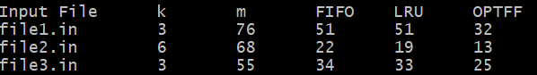

# algoprogassignment2
Brianna Chua, 76131392

Jaden Delapaz, 19812001

# Requirements/Assumptions
1. Python is installed

# How to Run (singular tests)
1. In a terminal, enter the src directory
2. Run "python main.py /tests/example.in"

# How to Run (question 1 test and generation)
1. In a terminal, enter the src directory
2. Run "python generator.py"
3. 3 nontrivial files can be found in /tests/question1-test#

# Question 1

(3 generated files can be seen in /tests/question1-test1)

Does OPTFF have the fewest misses?
Yes. According to the table, in all three input files, OPTFF has the fewest cache misses compared to FIFO and LRU. This is because OPTFF knows the entire future request sequence and evicts the item whose next use is farthest in the future. This optimal eviction choices allows the algorithm to always produce the minimum possible number of misses for a given sequence.

How does FIFO compare to LRU?
In these tests, LRU performs slightly better than FIFO. While in file1.in, FIFO and LRU perform the exact same (51 misses each), in file2.in and file3.in, LRU performs better with 3 and 1 less misses respectively. This is perhaps because LRU keeps recently used items which are more likely to be used again soon while FIFO evicts the item that has been in the cache the longest without considering how recently it was used. This can sometimes remove items that will be needed again soon.

# Question 2

There exists a request sequence where k = 3 for which OPTFF incurs strictly fewer misses than LRU.

Suppose we have a sequence:

[4 3 2 1 4 3 3]

With LRU as our cache eviction policy, it will have a total of 6 misses.
With OPTFF as our cache eviction policy, it will have a total of 4 misses. 

The reason why OPTFF has strictly fewer misses than LRU in this case is because OPTFF knows when an item will be used in the future. In this case, it sees that [4 3] will be requested again, and does not evict them. On the other hand, the LRU eviction policy only chooses to evict the item when it sees that it hasn't been used in a while. This causes more misses, since it evicts the item 4 when 1 is requested, not knowing 4 will be requested right after.

# Question 3
1. Assume for contradiction that there exists an optimal request sequence where algorithm A has fewer cache missees than OPTFF
2. At k + 1, the behavior differs from OPTFF at the earliest possible request. If there is no difference, then A is the same as the OPTFF algorithm and is optimal
3. Up until k + 1, both algorithms have proccessed the same requests, their caches contain the same items, a cache miss occurs, and the cache is full
4. At k + 1, OPTFF evicts item x, whose next use is farthest in the future while A evicts a different item y
5. Since OPTFF chose x, the next request for x occurs later than or equal to the next request for y (by definition of OPTFF)
6. This means that y will be requested again before x
7. Since A evicted y, it will incur a cache miss earlier than OPTFF
8. If we modify algorithm A so that it evicts x instead of y at this step, the number of misses does not increase
9. This creates another algorithm that has no more misses than A and aggrees with OPTFF for a longer prefix of the sequence
10. This is a contradiction since we assumed that A was the earliest algorithm that differed from OPTFF while achieving fewer misses
11. Hence, there is no algorithm that can have fewer cache misses than OPTFF on any fixed request sequence. OPTFF is optimal